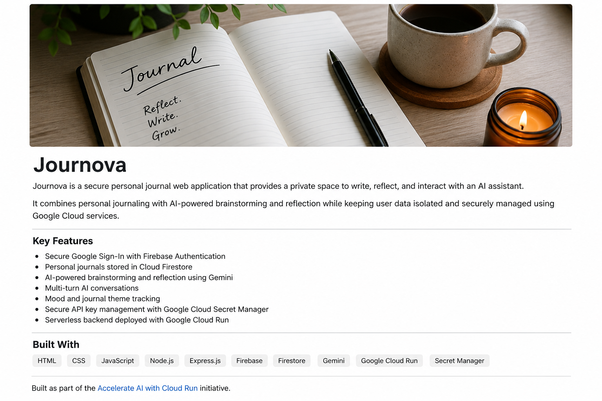

# Journova

  

Journova is a secure personal journal web application that provides a private space to write, reflect, and interact with an AI assistant.

It combines personal journaling with AI-powered brainstorming and reflection while keeping user data isolated and securely managed using Google Cloud services.

## Features

- Secure Google Sign-In using Firebase Authentication
- Create, save, and manage personal journal entries
- AI-powered brainstorming and reflection using Gemini
- Multi-turn AI conversations
- Mood and theme tracking
- Secure API key management using Google Cloud Secret Manager
- Serverless backend deployed on Google Cloud Run

## Technologies

HTML · CSS · JavaScript · Node.js · Express.js · Firebase · Firestore · Gemini · Google Cloud Run · Secret Manager

## About

Journova was built as part of the **Accelerate AI with Cloud Run** initiative, exploring how AI and Google Cloud services can be combined to create a secure and private journaling experience.

**Your Journal. Your Data. Your AI.**
